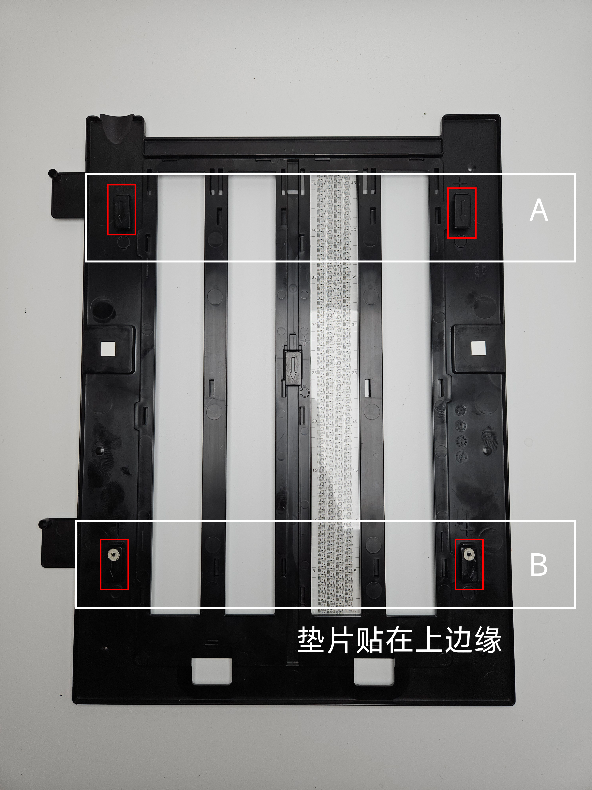
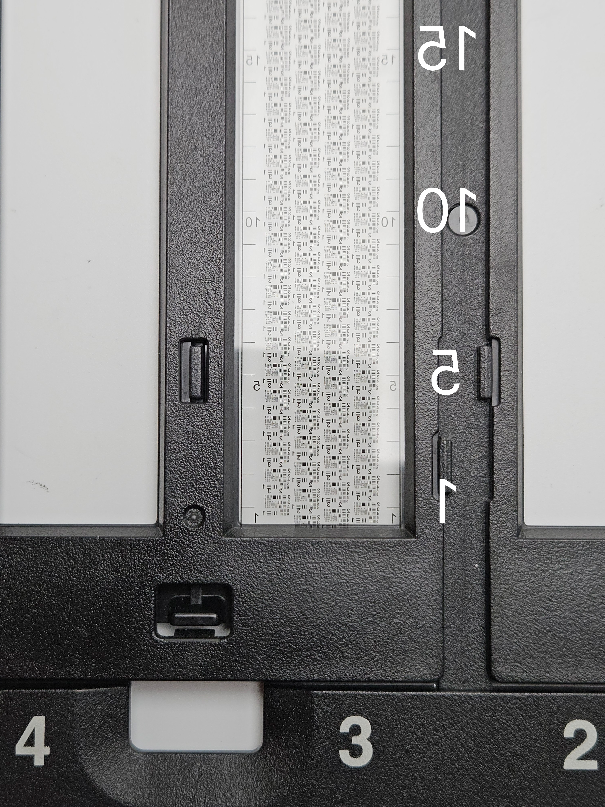
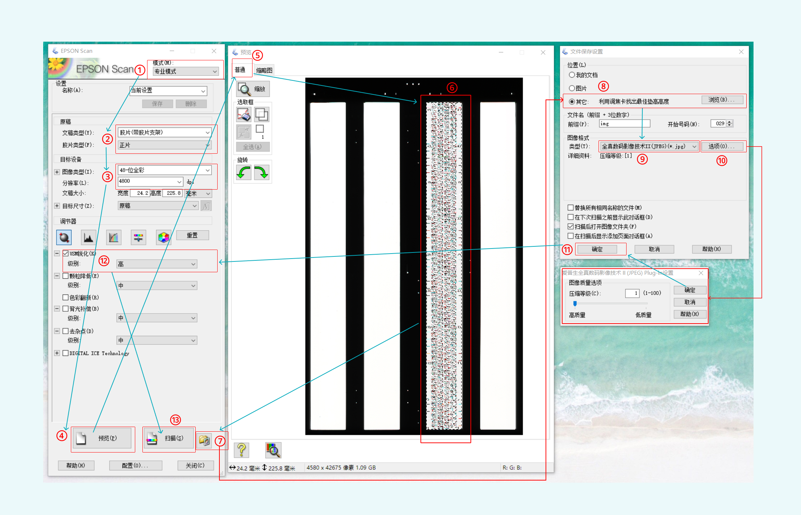

# 利用标靶扫描锐度计算片夹垫高高度（135调焦卡）

> 适用场景：在使用爱普生平板扫描仪扫描底片时，原装片夹可能高度不满足最佳锐度的焦平面高度，此时可以用本工具找出最佳垫高的高度。
>
> 按爱普生V700、V750扫描仪原装片夹，调焦卡裁至 0-45 可平整装入片夹。

## 推荐操作流程

> 点击下列蓝色链接也可查看原图

1. **准备垫片**：按 [垫片粘贴示意图](垫片粘贴示意图.jpg) 粘贴垫片；垫片规格参考 [0.2mm](垫片规格0.2mm.jpg) / [0.1mm](垫片规格0.1mm.jpg)。默认 **B组 垫高 4mm**（A组 = 0），也可改用其他高度，告诉 AI 即可。

   
2. **装载调焦卡**：按 [调教卡放置示意图](调教卡放置示意图.jpg) 把 135 调教卡装入片夹。

   
3. **扫描**：按 [epson\_scan操作流程](epson_scan操作流程.jpg) 操作得到长条扫描图像。

   
4. **粗测**：将扫描图像喂给 AI，计算得到初步推荐高度 **d（即 Zf1）。要求不高时直接按 d 同步垫高 4 个支脚即可。**
5. **精测装夹**：取 e = 0.2 / 0.3 / 0.4 mm ......（推荐 e ≤ 0.6），将片夹支脚 **A组 垫高 d − e**、**B组 垫高 d + e**。
6. **精测计算**：再次扫描并将图像喂给 AI，计算得到无需心算的**绝对最佳高度。**
7. **最终垫高**：按绝对最佳高度同步垫高 4 个支脚，即可提升扫描精度。

---

## 1. 脚本流程（七步）

把 USAF 1951 黑白标靶装入 135 片夹（即「135 调焦卡」），片夹两端不对称垫高（按推荐流程即 B组 高于 A组），扫描得到长条图。沿长轴各段处于不同焦平面，必有一段恰好落在扫描仪最佳焦点。

`tilt_focus_sweep.py` 的七步如下：

1. 传入长条扫描单图 + 垫高量 `--lift-mm`
2. `crop_center_strip` 裁 3500px 宽中心竖条（只锁标靶主体，排除画幅差异）
3. 沿竖条高度均分 **n 份（默认 45，`--n` 可调）**
4. 逐份 `calculate_sharpness` 算 sharp（块内细密黑白精度锐度）
5. 逐份 `chromatic_aberration` 算 CA（横向色差，单位≈px，越小越好）
6. 逐份综合排名：把 sharp、反相 CA 分别归一化到 0..1，按 **sharp : CA = 0.7 : 0.3** 合成 `comp`（综合锐度）并排名（权重可用 `--w-sharp` / `--w-ca` 覆盖）
   - 理由：`sharp` 是聚焦的直接、低噪声信号，权重应最高；`CA` 受镜头场曲/边缘效应与逐份边缘数量不均影响，噪声较大，只作辅助/置信修正。
7. **回截窗口（全宽）+ 物理换算**：取 `comp` 最高的那一份，连同前 5 份 + 后 5 份（边缘不足时自动收窄），从**原图全宽**截取该高度区间并 100% 画质保存，红框横贯全宽标出最高份；同时按公式算最佳锐度应垫高高度：**四个支脚统一垫起 = X × Y / n**（X = 当前高低差 mm，Y = 最佳份序号 1..n）。

**输出**：脚本只落盘两张图，所有逐份 sharp/CA/综合与物理换算量**打印在控制台**（不再写 JSON）：

| 文件                       | 内容                                           |
| ------------------------ | -------------------------------------------- |
| `tilt_sweep_profile.png` | n 份 sharp / 反相 CA / 综合 曲线，绿影 = 窗口份数，红点 = 最高份 |
| `tilt_best_window.jpg`   | 原图**全宽**回截窗口高度区间，**100% 画质**，红框横贯全宽标最高份      |

**核心结论**：四个支脚统一垫起高度 = **X × Y / n**（n = 均分数，默认 45；X = 当前高低差 mm，Y = 最佳份序号 1..n）。

---

## 2. 两遍精测法（推荐，定位精度提升约 3×）

单次 45 份在 4mm 跨度下分辨率约 `4/45 ≈ 0.089mm/份`，对亚毫米级片夹垫高（0.1/0.2mm 垫片）仍偏粗。采用「粗测定位 + 精测细化」两遍法，把**覆盖宽度**与**定位分辨率**解耦（与上方「推荐流程」第 4–6 步一一对应）。

### 2.1 第 1 遍（粗）

大跨度保证峰值一定被覆盖、离焦对比强。高低差 X = 4mm（按推荐流程即 B组 垫高 4mm、A组 = 0）。

```bash
python tilt_focus_sweep.py <长条图> --lift-mm 4 --n 45
```

→ 得 `Zf1`（即推荐流程的初步推荐高度 **d**，如 `0.889mm`），分辨率 ≈ 4/45 ≈ 0.089 mm/份。

### 2.2 第 2 遍（精）

取 e = 0.2mm（推荐流程允许 0.2/0.3/0.4，建议 ≤0.6），按「低端 = d − e、高端 = d + e」（即示意图 A组 = d−e、B组 = d+e）构造对称倾斜（跨度 2e，中心 = d），n=15 提升分辨率。

- 物理垫高（与推荐流程一致）：**低端 = d − e、高端 = d + e**（e=0.2 即 低端=d−0.2、高端=d+0.2，跨度 0.4mm）。对应示意图支脚：**A组 = 低端支脚、B组 = 高端支脚**，故即「A组垫高 d−e、B组垫高 d+e」。
- 扫描后运行（第二遍告诉 AI 时一并给出 `--low-lift-mm`，即 低端绝对垫高 d−e）：

```bash
python tilt_focus_sweep.py <第二遍长条图> --lift-mm 0.4 --n 15 --low-lift-mm <d-0.2>
```

→ 脚本直接输出 **绝对最佳高度 = 低端垫高 + Zf2 = (d−e) + Zf2**（分辨率 ≈ 0.4/15 ≈ 0.027 mm/份），即你最终应**同步垫到的统一高度**，**无需心算**。

### 2.3 校验与注意

- 第 2 遍峰值应落中间段（第 4–12/15 份）；若贴边（第 1 或 15 份）说明第 1 遍估计偏了，用新 Zf 重算 A/B组垫高再跑。
- 两遍必须**同张 135 调焦卡、同格、同方向**（顶部 = 低端 = 示意图 A组支脚，垫付高端 = 序号小端 = B组支脚），否则绝对基准漂移。
- 第二遍跨度仅 2e（默认 0.4mm），所有份都接近正焦、sharp 绝对差异小，但峰值附近对高度最敏感且 n=15 块大统计稳，可定位；若噪声明显可试 n=45（仅长图建议，避免短图块过薄）。

---

## 3. 限制与建议

- 该度量对**标靶内容**敏感：真实 USAF 1951 各组线密度不同，若长条内某段正好全是极细线组，即使略离焦也可能给出较高 sharp。建议第一遍垫高量足够大（如 4mm），使离焦带来的锐度下降**明显超过**内容差异；或在目标区域使用内容均匀的细光栅条。
- 默认 45 份每份高度较小（约 75–110px），`calculate_sharpness` 的 `GaussianBlur(σ=18)` 仍能工作，但真实标靶在该尺度下必须仍有细密线组覆盖，否则指标会失效。短长条（如 4700px）建议第二遍改用 n=15，单块更厚、统计更稳。
